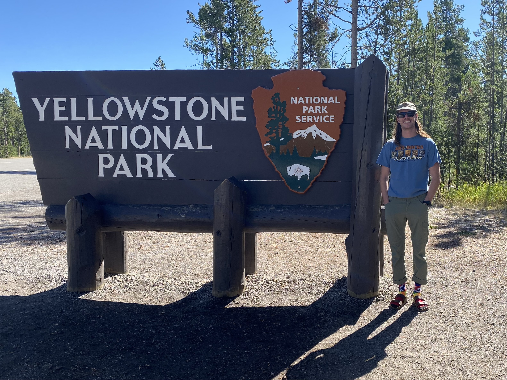

# Killian Cochran

**Graduate Student** 

Appalachian State University, Boone, NC, USA

### Summary
Highly skilled and motivated professional with a strong background in conservation and geoscience, equipped with a wealth of experience in research methodologies and report preparation. 

[LinkedIn](https://www.linkedin.com/in/killian-cochran/)

### Experience
**Water Conservation - Intern**

*City of Bend 2023 - 2024*

Providing assistance with water conservation efforts that include irrigation system evaluations, water use analysis, creation/editing of maps and data using GIS.

**Hydrographic Survey Technician**

*Geodynamics LLC 2022 – 2023*

Assisting with field data collection in various marine and terrestrial environments using modern techniques. Other duties include data processing, analysis, report production, and equipment maintenance.

### Education
**BS Geology 2020**

*Appalachian State University*

Boone, NC, USA

**AS Science 2018**

*Coastal Carolina Community College*

Jacksonville, NC, USA

### Projects
**Little Creek Hydrographic Survey**

This project involved bathymetric elevations collected along planned survey lines using single beam sonar (SBS) and a Digital Elevation Model (DEM) of the survey area in Bridge Creek, Virginia. I was the lead hydrographer, navigating and collecting survey data. Data was collected, downloaded, and cleaned. Then sent back to the office for map development and full report.

**Nags Head Geophysical Survey**

This Phase II survey included side-scan sonar (SSS), marine magnetometer (MAG), and sub-bottom profiling (SBP) geophysical survey acquisition. This project entails a full survey report and geophysical assessment of the data acquired.

**Masonboro Inlet Jetty System Hydrographic Survey**

This survey included a high-resolution geophysical survey using multibeam echosounder (MBES) for surveying the sub-aqueous portions of the North and South Jetties.

### Skills

•   GIS

•   Field Work

•	Sampling

•	Data Acquisition

•	Data Processing

•	Report Preparation

•	Topographic Survey

•	Hydrographic Survey

•	Geophysical Survey

•	Adobe Illustrator and Photoshop 

•	Microsoft Word, PowerPoint, and Excel

### Volunteer Work
**The Surfrider Foundation** - *Bogue Banks Chapter*

Showing up once a month to different locations in Emerald, Isle, North Carolina to pick up trash off the beach with the community. 